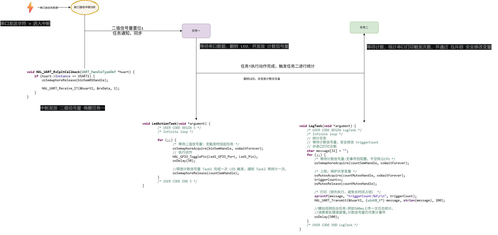

# FreeRTOS on STM32F102C8T6
本项目是基于 STM32F102C8T6 的 FreeRTOS 简易示例,通过一些简单的项目来学习FreeRTOS源码和RTOS的运行机制。不同的项目使用git branch进行管理。每个项目描述通过ReadMe描述
## 基本运行环境
1. STM32CubeIDE 1.17.0、CUbeMX 6.13、
2. FreeRTOS接口CMSIS V2、FreeRTOS 10.3.1
3. 硬件环境STM32F102C8T6(洋桃1号核心板)
## FreeRTOS 运行机制
[在线查看FreeRTOS Drawio](https://app.diagrams.net/?url=https://raw.githubusercontent.com/linfeng521/FreeRTOStudy/refs/heads/main/imgs/FreeRTOS.drawio)

## 项目一：一个串口中断控制 LED ：

### 项目描述
1. 串口接收触发事件

    PC 向串口发送任意一个字符后：

    USART 接收中断触发
    在 ISR 中释放 二值信号量
    唤醒 LED 控制任务

    实现中断与任务同步，避免在中断中直接处理业务逻辑。

2. LED 控制任务执行动作

    LED任务被唤醒后：

    翻转一次 LED 状态
    释放 计数信号量

    表示：

    已完成一次 LED 触发事件，通知统计任务处理。

3. 统计任务后台处理

    统计任务等待计数信号量：

    每收到一次信号后：

    使用互斥锁保护共享变量 triggerCount
    触发次数 +1
    通过串口打印当前累计次数

### 任务描述：
1、任务1：LED执行任务（动作任务）

    等待二值信号量：
        收到串口触发请求

    执行：
        翻转 LED
        通知统计任务

2、任务2：统计任务（后台任务）

    等待计数信号量：
        收到一次已完成事件

    执行：
        triggerCount++
        串口打印日志

3、中断服务函数 ISR（非任务）

    负责：
        接收串口数据
        释放二值信号量
        重新开启下一次接收
    ISR 只做快速通知，不做耗时工作。
